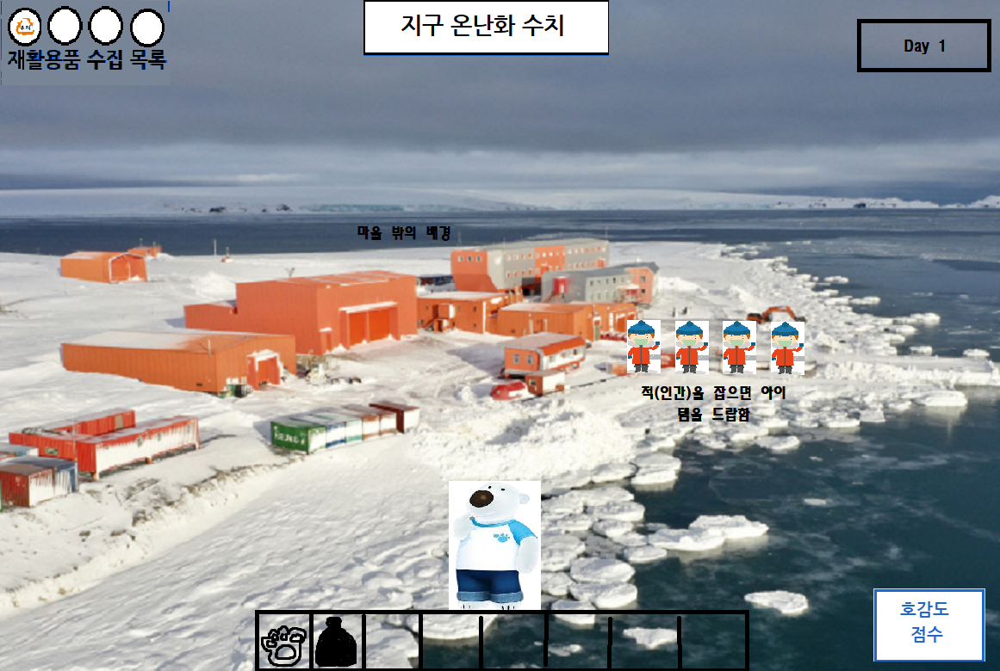

# 프로젝트명 : OVERCOME (1988042 하영민, 1988002 고정용) 

 

# [ 목차 ]
### 1. [컨셉](#1)
### 2. [관련 이미지 & 동영상](#2)
### 3. [대표 이미지 그리고 컨셉과 대표이미지 기반 작품 묘사](#3)
### 4. [OVERCOME 구성 요소](#4)
### 5. [게임 시스템 디자인](#5)
### 6. [개발 요구사항 & 흐름도](#6)
### 7. [스토리보드](#7)

 

# [컨셉] 
## 메인컨셉 :

- 현재 지구가 처한 기후위기를 극복하기 위해 북극곰이 남극에 사는 펭귄들과 함께 과거 깨끗했던 지구의 환경으로 복구시키는 이야기

### 서브 컨셉 1 : 청소

- 인간들에 의해서 더렵혀진 환경을 청소함으로써 현재 처한 지구의 기후위기를 극복하는 과정
- 마을 바깥의 환경을 더럽히고 있는 인간을 플레이어가 공격하여 그들이 버리려는 쓰레기를 빼앗아 더이상 더럽히지 못하도록 함.
- 추가로 이미 더러워진 환경을 획득한 아이템을 통해 정화할 수 있음.
### 서브 컨셉 2 : 대화

- 플레이어가 마을의 NPC들과의 대화를 통해 마을의 사건들과 인간들을 막는 퀘스트를 진행할 수 있음.
- 상점의 NPC를 통해 플레이어가 획득한 재화를 사용하여 청소를 더 빨리 할 수 있는 아이템을 교환하거나, 인간을 막아낼 수 있는 아이템을 교환할 수 있음.
- 대화를 통해 전체적인 게임의 스토리를 파악하고, 이를 통해 환경보호의 중요성을 플레이어에게 느끼게 해줄 수 있을 것이라 기대됨.

### 서브 컨셉 3 : 주변 환경

- 스테이지를 진행할 수록 더러웠던 배경이 플레이어의 총소로 인해 다시 깨끗했던 남극으로 점차 바뀌어감.
- 스토리의 진행 상황을 이를 통해 대략적으로 알 수 있게 함.

### 서브 컨셉 4 : 간편한 조작, UI

- 마우스가 회전하는 방향으로 화면이 돌아가고 방향키를 눌러 플레이어의 이동과 공격, 또는 NPC와의 상호작용을 할 수 있음.
- 인벤토리와 진행 날짜, 획득한 재화만을 표시하여 한눈에 보기 편한 UI를 제공함.

### 서브 컨셉 5 : Low Poly 그래픽

- 게임 ‘동물의 숲’과 같은 아기자기한 그래픽을 사용하여 무거운 주제에 플레이어가 쉽게 다가갈 수 있도록 함.
    
  
# [관련 이미지 & 동영상] 

- 이미지  
  
  

  
- 동영상  
  현재 지구가 처한 상황  
  

  

# [OVERCOME 구성 요소] 

 

## 1. 메커니즘

### [도전 과제]

1. 지구온난화와 기후환경에 해로운 각종 대기 오염 물질과의 전투.

2. 스테이지 내에서 획득 가능한 병, 캔, 고철, 플라스틱을 수집하여 펭귄마을 재활용 센터에서 아이템으로 교환.

3. 분리수거를 통해 펭귄마을의 신뢰도 점수의 상승과 하락.

4. 무기 혹은 아이템과 별개로 지구온난화 수치가 호전되면 플레이어의 전투력이 상승.

### [재미 요소]

1. 실제 우리가 처한 지구의 위기가 배경

2. 현실에서 우리가 할 수 있는 것들을 퀘스트로 만들어 재미있고, 실천 가능하다는 것을 알게되는 재미

3. 수집한 쓰레기들을 재활용하여 무기 혹은 아이템을 제작

4. 퀘스트와 스토리를 진행하면 지구의 환경이 점점 좋아지는 것을 빙하가 점점 얼어가고 복구되는 것으로 맵에서 시각적으로 표현

5. 지구의 환경이 좋아질수록 플레이어의 전투력 상승
 

## 2. 이야기

### [만들게 된 배경] 

어느 날 유튜브를 보면서 알고리즘의 흐름에 따라 “지구 전체를 박살내고 있는 인류… 정말 이대로라면 6번째 대멸종이 온다고?” 라는 영상을 보게 되었다. 그 영상에서 우리 인류는 현재 6차 대멸종에 가까워져 가고 있다 하였다.
이것을 본 후 우리는 사람들이 지구온난화를 극복하기 위한 최소한의 실천방법이라도 알았으면 좋겠다라는 생각에 이것을 주제로 하여 사람들에게 지구온난화의 위험성을 느끼게 하고, 개인이 할 수 있는 최소한의 노력을 알려주기 위해 이러한 게임을 제작하게 되었다.

 

### [카메라 관점] 

3인칭 카메라 시점으로 게임을 진행하며, 게임 내에 있는 컨텐츠인 분리수거를 하는 미니게임은 1인칭으로 진행하여 플레이어가 실제로 분리수거를 하는 느낌을 제공한다.

 

## 3. 미적요소

### [디자인] 

Low-Poly 그래픽을 활용해 남극을 배경으로 한 펭귄마을과 스테이지들을 플레이

진행도에 따라 마을과 스테이지의 빙하들이 복구되면서 지구온난화가 극복되는 것을 시각적으로 보여주며 플레이어에게 진행도를 암묵적으로 보여준다.

무기 혹은 아이템은 병, 캔, 플라스틱, 고철을 활용해 디자인

### [컬러] 

남극의 디자인과 맞게 빙하의 색깔과 바다의 색깔을 활용해 추운 느낌을 주도록 구현

괴짜 펭귄의 집 내부는 어두운 조명과 음산한 분위기를 활용해 플레이어에게 심상치 않은 곳이라는 것을 느끼게 구현

### [음향]  

마을 구석진 장소에서는 공장에서 나는 태우는 소리나 팬 돌아가는 소리를 활용해 지구온난화의 많은 피해를 주는 석탄가스를 활용하는 펭귄마을의 심각성을 구현.

마을 진입 시 잔잔한 브금을 활용해 펭귄마을 주민들은 현재 지구가 처한 위기를 인지 못하는 평화로운 상태임을 구현.
 

## 4. 기술

Unity Engine과 Blender를 활용해 게임을 제작

PC용으로 개발, 저사양으로도 플레이 할 수 있도록 개발할 예정.

 

# [게임 시스템 디자인] 

## a. 게임 오브젝트 분해 (구성 요소 분석)

|연번|오브젝트 이름|오브젝트 이미지|
|:----:|:----:|:----:|
|1|펭귄 포모나||
|2|촌장 도널드||
|3|펭귄 주민||
|4|웅||
|5|메탄 가스||
|6|이산화탄소||
|7|이산화질소||
|8|인간||
|9|고철 더미||
|10|플라스틱||
|11|쓰레기||
|12|병||
|13|무기||
|14|인벤토리||
|15|수집품||
|16|호감도||
|17|지구온난화 수치||

 

## b. 파라미터 (속성)

 

## c. 행동
### 1. 오브젝트 이름 : 플레이어(웅)
|행동|설명|
|:----:|:----:|
|앞으로 이동|W키 입력 시 바라보고 있는 방향으로 이동|
|좌우 이동|A키, D키 입력 시 방향 좌(A),우(D)로 이동|
|뒤로 이동|S키 입력 시 바라보고 있는 방향의 뒤쪽으로 이동|
|뛰기|Shift키 입력 시 이동속도 증가|
|공격|무기 보유 중에 C키 입력 시 무기를 휘두르며 공격|
|상호작용|E키 입력 시 주민들과의 퀘스트나 대화 진행|
|아이템 줍기|G키 입력 시 바닥에 떨어져 있는 재활용품이나 쓰레기를 줍는다.|
|높은 등급 무기 강화 성공 포즈|높은 등급의 무기 강화가 성공했을 때 하는 행동|
|높은 등급 무기 강화 실패 포즈|높은 등급의 무기 강화가 실패했을 때 하는 행동|

 

### 2. 오브젝트 이름 : 몬스터(메탄가스, 이산화탄소, 이산화질소, 인간)
|행동|설명|
|:----:|:----:|
|공격|플레이어가 범위내에 들어올 경우 공격|
|피격|플레이어의 공격에 맞았을 때 나오는 모션|
|사망|몬스터의 HP가 0이 되었을 때 사망|
|순찰|몬스터가 순찰 상태에서 하는 행동|

 

## d. 상태 

### 1. 오브젝트 이름 : 플레이어(웅)
|현상태|전이상태|전이조건|
|:----:|:----:|:----:|
|기본 상태(Idle)|기본 상태(Idle)|아무 행동도 하지 않음.|
|기본 상태(Idle)|앞으로 이동|W키 입력|
|기본 상태(Idle)|뒤로 이동|S키 입력|
|기본 상태(Idle)|왼쪽으로 이동|A키 입력|
|기본 상태(Idle)|오른쪽으로 이동|D키 입력|
|기본 상태(Idle)|달리기|Shift키 입력|
|기본 상태(Idle)|공격|무기를 들고 있는 상태에서 C키 입력|
|기본 상태(Idle)|상호작용(대화)|NPC 근처에서 E키 입력|
|기본 상태(Idle)|물건 집기|물건에 다가가서 G키 입력|

 

## e. 플레이어 캐릭터 속성 (파라미터) 

 

## f. 게임의 규칙

### <핵심 규칙>
1. 사용자는 플레이어(웅)로 플레이한다.
2. 필드에 생성된 몬스터를 처치하여 아이템(재활용품)을 획득한다.
3. 필드에서 획득한 아이템(재활용품)은 마을의 재활용 센터에서 사용한다.
4. 사용자는 마을의 주민으로부터 퀘스트를 제안받고, 수락할 수 있다.
5. 수락한 퀘스트를 수행함으로 마을 주민들의 호감도를 상승시킬 수 있다.
6. 지구온난화 수치가 일정 수준 이상으로 상승하게 되면 게임 실패이다.
7. 사용자는 지구온난화 수치를 낮추기 위해 마을의 재활용 센터에서의 임무를 수행해야 한다.
8. 이전 스테이지를 클리어하지 않으면 다음 스테이지로 이동하지 못한다.

 

### <보조 규칙>
 1. 스테이지가 진행됨에 따라 등장하는 몬스터가 달라진다.
 2. 분리수거장으로 들어가기 위해서는 반드시 재활용품을 지니고 있어야 입장이 가능하다.

 

## g. 게임에서 사용될 공식

### < 재활용품 무기 제작 이벤트 >
- 무기 제작 의뢰 버튼을 누를 경우, 필요한 재활용품의 종류와 현재 사용자가 소지 중인 재활용품 비교하고, 그것이 같은 종류라면 0, 다른 재활용품이라면 1로 결과를 도출 ( result )
- 현재 사용자가 소지 중인 재활용품의 개수 – 필요한 재활용품의 개수 ( result 2 )
- result의 값이 0이며, result 2의 값이 0보다 크다면 result 2의 값으로 사용자가 소지 중인 재활용품의 개수를 조정 후 무기 제작을 시작.

 

### < 무기 제작 시 무기 등급에 따른 이벤트 >
- 무기 제작이 되면 플레이어에게 지급될 무기에 1에서 6 사이의 등급을 랜덤하게 정함. ( result )
- result의 값이 3 이하일 경우 (1, 2, 3), 폭발하는 효과가 나오며 괴짜 펭귄이 두 팔을 들고 환호하는 애니메이션이 나옴.
- result의 값이 4 이상일 경우 (4, 5, 6), 연기가 피어오르는 효과가 나오며, 괴짜 펭귄의 등이 굽으며 시무룩 해하는 애니메이션이 나옴.
- 사용자에게 제작된 무기를 지급.

 

### < 분리수거장 >
- 사용자가 소지 중인 재활용품의 수 ( result )
- result > 0일 경우에만 분리수거장에 출입 가능.

 

### < 분리수거장 - 분리수거 >
- 재활용품이 들어가는 곳의 정보 ( result )
- 사용자가 현재 들고 있는 재활용품이 무엇인지 확인 ( result 2 )
- 현재 들고 있는 재활용품을 재활용품이 들어가는 곳에 놓았을 때, result = result 2일 경우 성공을 알리는 음향 효과를 재생.
- 위의 상황에서 result ≠ result 2일 경우 실패를 알리는 음향 효과와 함께 연기 피어오르는 효과를 실행.

 

### < 각 스테이지 전투 >
- 적의 체력 – 사용자의 무기의 공격력 ( result )
- 적의 체력을 result 값으로 조정 후 result 값 초기화.
- 이후 적과 사용자와의 전투에서 result 값이 0보다 작아질 경우, 적의 상태를 사망상태로 전환.

 

# [개발 요구사항 & 흐름도] 

## a. 요구사항

 

## b. 시간별 흐름도 flowchart

 

## c. 키보드 이벤트에 대한 흐름도

 

## d. 용어정리

 

# [스토리보드] 
